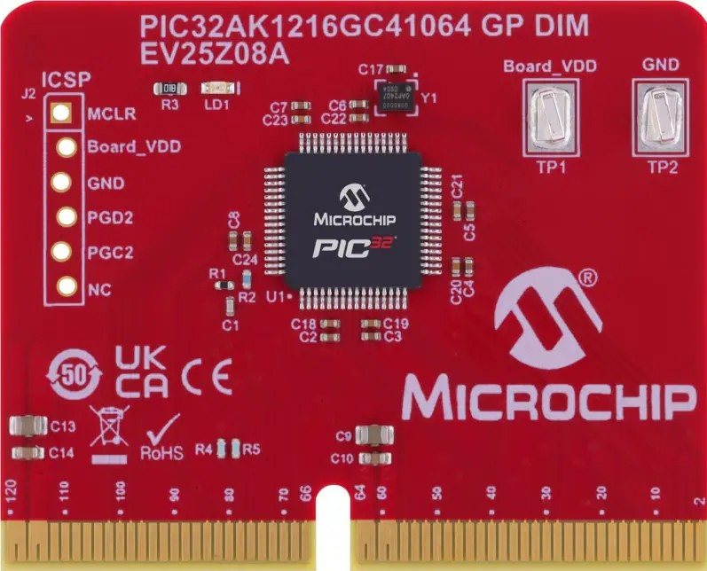
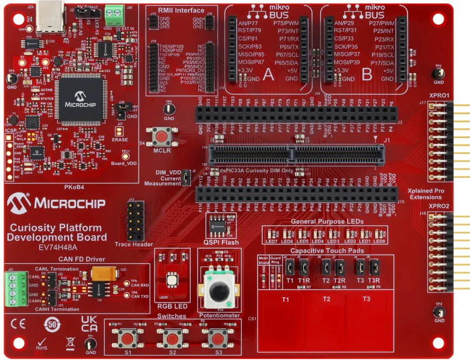

<picture>
    <source media="(prefers-color-scheme: dark)" srcset="./images/microchip_logo_white_red.png">
	<source media="(prefers-color-scheme: light)" srcset="./images/microchip_logo_black_red.png">
    
</picture>

## PIC32AK1216GC41064 GP DIM demo

## Summary
Demonstrates the basic capability of the PIC32AK1216GC41064 on the Curiosity Platform Development Board

## Related Documentation
1) [PIC32AK1216GC41064 Curiosity GP DIM](https://www.microchip.com/EV25Z08A)
2) [Curiosity Platform Development Board](http://www.microchip.com/EV74H48A)

## Software Used 
1) MPLAB X 6.25 or later with the following component versions:
2) XC32 4.60 or later

## Hardware Used
1) [PIC32AK1216GC41064 Curiosity GP DIM](https://www.microchip.com/EV25Z08A)
2) [Curiosity Platform Development Board](http://www.microchip.com/EV74H48A)

## Setup
1) Connect the PIC32AK1216GC41064 Curiosity GP DIM to the Curiosity Platform Development Board
2) Connect the USB-C port to a host computer
3) Compile and program the demo into the board
4) Open a serial terminal program to 9600 8-N-1 to the port associated with the board

## Operation
After completing the board setup in the prior section, you may interact with the board in the following ways:

**Basic I/O**
* LED7 reflects the status of the S1 button; On when pressed, off when released.
* LED6 reflects the status of the S2 button; On when pressed, off when released.
* LED5 reflects the status of the S3 button; On when pressed, off when released.

**ADC/PWM**
* Turning the potentiometer will vary the RGB LED brightness

**UART**
* Sending the ASCII characters 'r'(0x72), 'g'(0x67), or 'b'(0x62) over the UART (9600 8-N-1) will toggle the red/green/blue LEDs of the RGB LED respectively.
* A terminal program can be used to view the potentiometer value over the UART.

**Unsupported Board Features**
* This DIM does not support CAN functionality
* This DIM does not support the capacitive touch portion of the demo described in the Curiosity Platform Board user's guide.

## Factory Hex Files
The factory production .hex file is provided in this distribution.  The factory .hex file is often generated from pre-release version of tools so compiling the source with released version of tools may result in a different .hex file.  The factory .hex file is generated from the 1.0.0 version of the demo. 

